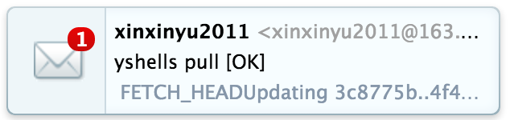
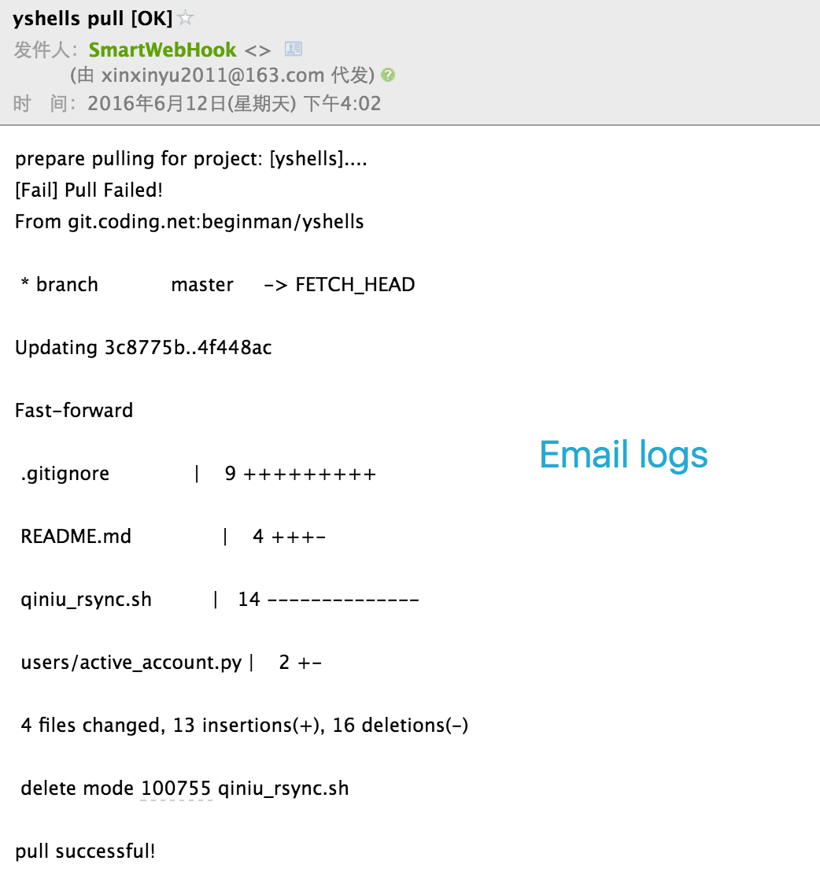

# smartwebhook

A smart git webhook bases on bottle supports to github and coding or other git platform.

# Usage

使用比较简单,大致意思就是在设置了webhook的git项目中,当ping或push代码后, git平台就会触发webhook

使用截图:

在我们的设置的webhook服务器上, 一旦监听到有ping或push请求就会处理。处理分以下几步:

1. 验证请求路径中对应的项目是否存在 (确定项目)
2. 验证请求头部是否合法并判断是哪个平台 (确定平台, coding.net, github或其他平台)
3. 验证Token是否正确 (确定合法请求)
4. 验证是否进行pull操作 (确定动作, 在配置文件中`pull_flag`中设置的pull操作的条件, 如果`git commit` 的提交日志中以`pull_flag`设置的值开头,则触发pull)
4. 执行命令(在配置文件中`command`选项下可设置shell脚本路径或直接写bash命令)
5. 发送邮件(确定结果, 在配置文件中可设置邮件信息, 处理结果会以邮件的形式反馈)

## Step 1 设置webhook:

格式如下:

    http://yourdomain/push/<yourproject>

如我在coding平台下名为yshells的项目中设置的是:

    http://xxxx.com:7777/push/yshells
    令牌是:abcdefg..

根据这种方式可以在多个项目中设置不同的webhook请求

## Step 2 写配置文件

在 app/projects.json中包括多个webhook的项目配置文件, 说明如下:

    {
        "project_name_1": {                                         // 你的项目名字,如yshells
            "path": "/path/to/your/yshells",                      // 项目的路径,在服务器中的绝对路径
            "command": "/path/to/your/yshells.sh",                  // shell脚本路径,在Shell脚本中可自由处理
            "pull_flag": "#online#",                                // pull动作执行的条件,根据git commit 日志匹配
            "token": "PL22m@3%!qaz",                                // 令牌环,这个需与webhook设置的一样
            "mail": {                                               // 邮箱信息
                "mail_host": "smtp.163.com",                        // host,这里我使用163邮箱
                "mail_port": 25,                                    // 端口,一般smtp服务用25端口
                "mail_user": "xinxinyu2011@163.com",                // 邮箱用户
                "mail_pass": "****",                                // 邮箱密码
                "mail_sender": "xinxinyu2011@163.com",              // 发送人
                "receivers": ["1373763906@qq.com"]                  // 接收人
            },
            "git": {                                                // git相关信息
                "coding" : {                                        // 哪个平台,如github, coding, 等
                    "X-Coding-Event": "push",                       // 请求Header的处理[必不可少],可参看相关平台上webhook帮助
                    "User-Agent": "Coding.net Hook"                 // 请求Header的处理[必不可少]
                }
            }

        },
        "project_name_2": {
            ...
        },
        ...
    }

## Step 3 写shell脚本
确实写什么脚本都行,无法改下代码而已,最常见的如shell脚本(例子: yshells.sh):

    #!/usr/bin/env bash
    git pull origin master
    echo "pull successful!"

别忘了赋予可执行权限:

    chmod a+x yshells.sh

## Step 4 启动你的项目开始使用吧~

如果你的`pull_flag` 写的是`#online#`, 那么:

如提交代码且远程更新, 在提交日志开头加上pull_flag值即可:

    ....
    git ci -m "#online# 你的提交日志..."
    ....

如提交代码但不更新:

    ....
    git ci -m "你的提交日志..."
    ....

注意: ping请求或 提交但不更新不会有email反馈。只有远程更新操作才会有email反馈。

# Reference Documents

- [coding](https://coding.net/help/doc/git/webhook.html)
- [github](https://developer.github.com/webhooks/)

# TODO:

- [ ] github webhook处理
- [ ] 自建git服务器中,webhook处理
- [ ] 处理更多自定义事件